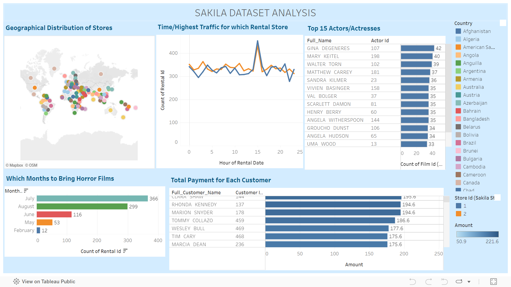

# *Sakila Database Analysis*

## :camera_flash: Dashboard Screenshots

[View here on Tableau](https://public.tableau.com/views/SakilaDatasetAnalysis_WK3/Dashboard1?:language=en-US&:sid=&:display_count=n&:origin=viz_share_link)

## :relaxed: Overview and Objectives
The Sakila sample database is a database designed to represent a DVD rental store. The tables of the database include film, film_category, actor, customer, rental, payment, and inventory among others.
As the analyst/BI expert, you are required to answer the following questions in Tableau to help the leads make better-informed decisions:
1. A geographical view of the distribution of stores
2. At what time does which rental store has the highest traffic?
3. Who were the top 15 actors/actresses?
4. Which months should we bring in the horror films?
5. What is the total payment for each customer?

## :computer: Setup
**Note**: If using the __trial version of Tableau desktop__ connect to the __SQL database with the credentials below__.
If using the the __Tableau Public you cannot connect to the SQL database__ but can obtain the files using the __Dataset Link below__.

SQL database
HOST: 20.218.241.192
DB_Name: sakila
username: dapLearner
password: $qlQu3ry&B!gData

[Dataset Link](https://drive.google.com/drive/folders/1iynE0Oz1Gtes5OzaYaehwDR26mQM9NvW?usp%3Dsharing)

## :scroll: Author
Gloria Givondo

## License
The content of this site is license under the MIT license
Copyright (c) 2024 **Gloria**